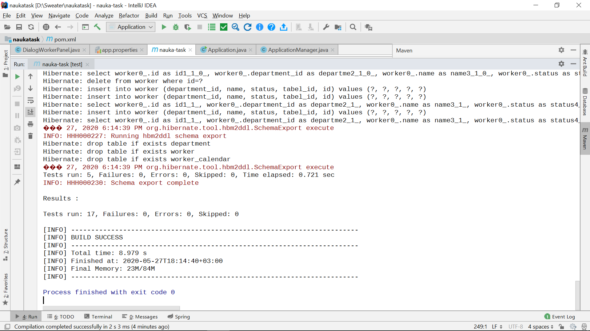

# Проект на стажировку для компании "Наука"
***

#### Задачи проекта:
- [x] Спроектировать схему базы данных;
- [x] Спроектировать интерфейс приложения;
- [ ] Реализовать изменения в департаменте;

#### Используемые технологии:
* Язык разработки: Java;
* База данных: MySql;
* Spring Data Jpa;
* Hibernate;
* Java Swing;
* jUnit.

#### Структура репозитория:
* в пакете *diagram* находится схема базы данных для 1-ой части задания;
* в пакете *naukatask* находится проект для 2-ой и 3-ей части задания.

#### Структура проекта:
* в пакете *config* располагаются классы, отвечающие за подключение к базе данных и инициализацию таблиц;
* в пакете *controllers* располагаются классы, реализующие логику приложения;
* в пакете *entity* располагаются классы, реализующие сущности таблиц;
* в пакете *repository* располагаются интерфейсы, описывающие запросы к базам данных;
* в пакете *service* располагаются классы, реализующие логику запросов к базам данных.

#### База данных:
База данных создается локально. Имя пользователя при входе: *root*; пароль при входе: *root*. Запрос к созданию базы данных в MySql:

    CREATE SCHEMA `testdb` DEFAULT CHARACTER SET utf8;

- Логика запросов, необходимая для выполнения третьей задачи, была реализована полностью.
- Ко всем классам, реализующим логику запросов, были написаны юнит-тесты. Все они успешно проходят:

#### Интерфейс
Интерфейс приложения был реализован с помощью технологии Java Swing.
* Выбранный месяц и департамент подсвечивается зеленым цветом.
* При смене месяца количество дней в месяце меняется соответствующим образом.
* При нажатии на кнопки добавления нового сотрудника и департамента появляется диалоговое окно.
* Если пользователь ввел некоректные данные в окне добавления сотрудника/департамента, возникает сообщение, предупреждающее пользователя об ошибке.
